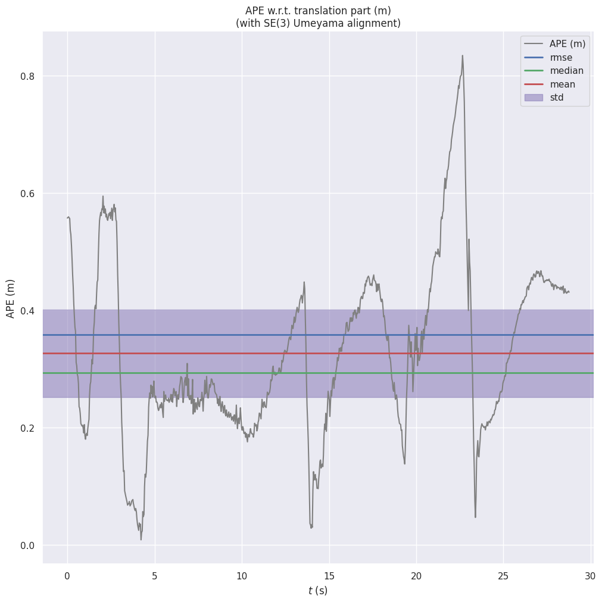
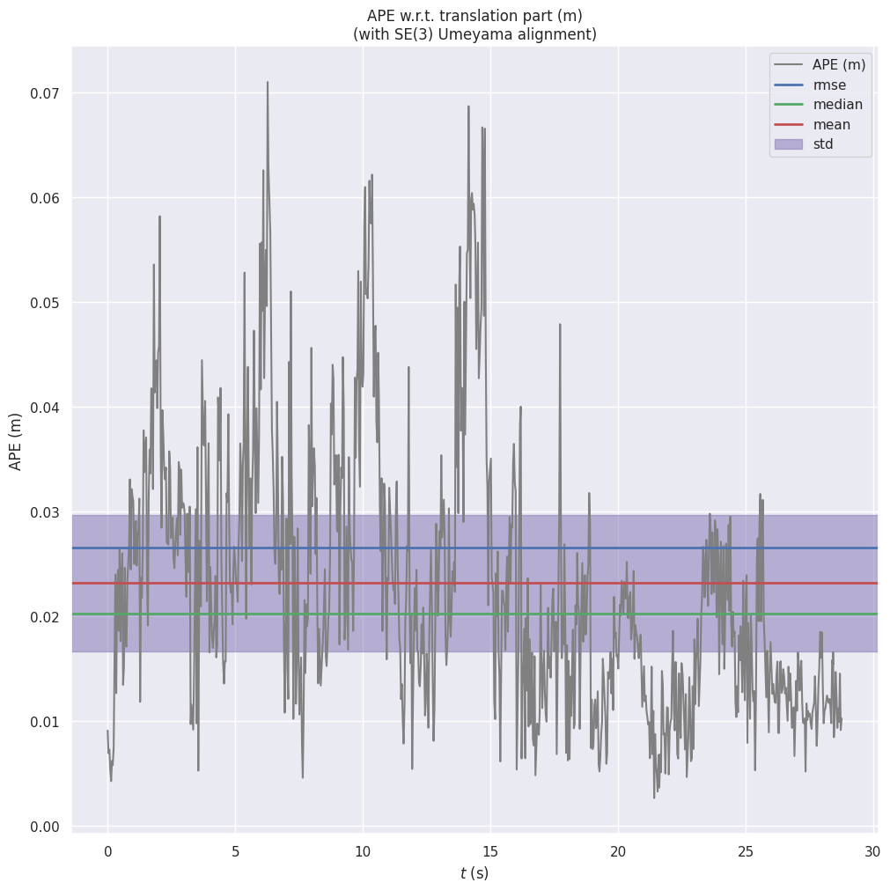

# Ghost-Free SLAM 🚀
### Recovering Static Scene Geometry in Crowded Dynamic Environments

Ghost-Free SLAM measures how much moving people hurt ORB-SLAM3 on dense RGB-D sequences, and how much of that damage can be undone by masking them out before feature extraction. Nothing inside ORB-SLAM3 is modified. Dynamic pixels are removed at the image level and the SLAM backend is treated as a black box.

The project started as a CS585 (Computer Vision) team project at Boston University in Spring 2026 and is now being extended toward a journal submission (IEEE RA-L).

**Status (September 2026):** all three experimental configurations have been run on all three TUM RGB-D `freiburg3` sequences. Trajectories, evo plots, and masking quality reports are committed. Current work is on the follow-up described in [What comes next](#-what-comes-next).

---

## 📌 Headline result

On `freiburg3_walking_xyz` (two people walking through the scene while the camera moves), masking dynamic pixels cuts ORB-SLAM3's Absolute Trajectory Error from **0.341 m to 0.027 m RMSE**, roughly a 12x reduction. On the two easier sequences the effect is much smaller, and on `sitting_xyz` masking makes things slightly worse.

<table>
  <tr>
    <th>Baseline ORB-SLAM3 (walking_xyz)</th>
    <th>Masked ORB-SLAM3 (walking_xyz)</th>
  </tr>
  <tr>
    <td></td>
    <td></td>
  </tr>
  <tr>
    <td>APE over time. Error mostly sits between 0.2 and 0.6 m and peaks at 0.83 m. Note the y-axis goes to 0.8 m.</td>
    <td>APE over time. Error stays below 0.071 m for the whole run. Note the y-axis goes to 0.07 m, about 12x smaller.</td>
  </tr>
</table>

Trajectory maps for both runs are in `results/baseline/camera_trajectories/walking_xyz/plot_map.png` and `results/masked/camera_trajectories/walking_xyz/walking_xyz_camera_map.png`.

---

## 📊 Full results

ATE RMSE (metres) of the **camera trajectory** against TUM ground truth, SE(3) Umeyama alignment, computed with `evo_ape tum <gt> <traj> -a`. All numbers below were regenerated from the trajectory files in `trajectories/` so they can be reproduced from this repo alone.

| Sequence | Frames | Baseline ORB-SLAM3 | Masking only | Masking + reprojection |
|---|---:|---:|---:|---:|
| `freiburg3_sitting_xyz` | 1261 | **0.015** | 0.029 | 0.026 |
| `freiburg3_walking_static` | 743 | 0.052 | 0.010 | **0.010** |
| `freiburg3_walking_xyz` | 859 | 0.341 | **0.027** | 0.028 |

All three runs track every sequence end to end (1230 / 723 / 833 poses respectively, same count in every configuration), so the differences are drift, not tracking loss.

What the table shows:

* **Masking is where the gain comes from.** On the two walking sequences, removing person pixels before ORB extraction is the difference between a usable and an unusable trajectory.
* **Reprojection did not add anything measurable on top of masking.** The numbers are within noise of the masking-only run (0.028 vs 0.027 on walking_xyz). The recovered pixels are copied from the previous frame using the masked-run poses, so they mostly reintroduce texture that ORB-SLAM3 already had a matching keyframe for. See [Geometric recovery](#-geometric-recovery-reprojection) for why.
* **On `sitting_xyz` masking hurts a little.** The people barely move, so their features are actually usable static structure. Masking them removes about 22% of every frame (see the masking report below) for no benefit.
* **We do not match DynaSLAM.** DynaSLAM (Bescos et al., 2018) reports 0.015 m on walking_xyz using Mask R-CNN plus multi-view geometry and background inpainting. Our 0.027 m sits between the raw ORB-SLAM3 baseline and that number. Closing this gap is the point of the follow-up work.

Per-sequence evo plots (trajectory, xyz, rpy, speed) for the baseline run are in `evaluation/<sequence>/`. Map and raw plots for every configuration are in `results/<mode>/camera_trajectories/<sequence>/` and `results/<mode>/keyframe_trajectories/<sequence>/`.

Note on the baseline numbers: the baseline plots and `results/baseline/camera_trajectories/summary.txt` come from an earlier baseline run (walking_xyz 0.359 m, walking_static 0.034 m, sitting_xyz 0.016 m). The table above uses the baseline trajectory files committed in `trajectories/baseline/`, which give 0.341 / 0.052 / 0.015 m.

---

## 🔬 System pipeline

```
TUM RGB-D sequence (rgb/, depth/, rgb.txt, depth.txt)
        │
        ▼
YOLO26m-seg instance segmentation, person class only        segmentation/run_instance_segmentation.py
  conf 0.22, IoU 0.4, 4x4 dilation, 21x21 Gaussian blur
        │
        ▼
Clean binary mask + masked RGB frames (depth untouched)     masking/apply_masks.py
        │
        ├──────────────────────────────────────────────┐
        ▼                                              ▼
ORB-SLAM3 RGB-D, headless, "masked" mode      reprojection/reproject.py
        │                                     fills masked pixels from the previous
        │                                     frame using masked-run poses + depth
        │                                              │
        │                                              ▼
        │                              ORB-SLAM3 RGB-D, "reprojection" mode
        ▼                                              ▼
CameraTrajectory.txt / KeyFrameTrajectory.txt  ──►  evo_ape (ATE RMSE) + plots
```

`slam/run_slam.sh <sequence> <mode>` is the single entry point for the SLAM stage. `mode` is `baseline`, `masked`, or `reprojection` and only changes which image folder ORB-SLAM3 reads.

### Segmentation and masking details

* Model: Ultralytics `yolo26m-seg.pt` (medium). We started with `yolo26n-seg.pt` (nano) and switched to medium in mid April after reworking the mask generation. Both weight files are committed at the repo root.
* Only COCO class 0 (person) is segmented. The TUM `freiburg3` dynamic sequences contain no other moving objects.
* Confidence threshold is deliberately low (0.22) and every mask is dilated by 4 px and blurred with a 21x21 kernel, then thresholded at 0.3. Over-masking a person's outline is much cheaper for SLAM than leaving a strip of moving pixels behind.
* `masking/apply_masks.py` derives a clean binary mask (pixels black in the YOLO output but not black in the original) and zeroes those pixels in the original RGB. Depth is never modified. Frames with no detection are copied through unchanged.

<p align="center">
  
  <br>
  <em>walking_xyz, original vs masked frame. More example strips in <code>masking/masked_frames/examples/</code>.</em>
</p>

### Masking quality (from `evaluation/validate_masking.py`)

The validation script flags three failure types per frame: missed detection (no mask saved), partial mask (a connected region far too small for a person) and over-mask (region implausibly large). Numbers below are from `evaluation/validation_report/summary.txt`.

| Sequence | Frames | Frames with mask | Missed | Over-mask | Partial | Avg masked area |
|---|---:|---:|---:|---:|---:|---:|
| sitting_xyz | 1261 | 1261 | 0 (0.0%) | 56 (4.4%) | 31 (2.5%) | 21.6% |
| walking_static | 743 | 698 | 45 (6.1%) | 84 (12.0%) | 38 (5.4%) | 19.3% |
| walking_xyz | 859 | 776 | 83 (9.7%) | 132 (17.0%) | 19 (2.4%) | 19.8% |
| **Overall** | **2863** | **2735 (95.5%)** | **128 (4.5%)** | **272** | **88** | |

"Missed" here means no mask file was saved for that frame. Looking at the flagged frames in `evaluation/validation_report/rgbd_dataset_freiburg3_walking_xyz/failures_missed_detection.png`, many of them are moments where both people have walked out of view, so the true miss rate is lower than 9.7%. The real misses are motion-blurred people half outside the image border. Those frames go into SLAM unmasked, which is one reason we still trail DynaSLAM. Comparison grids and flagged failure frames for every sequence are in `evaluation/validation_report/<sequence>/`.

### 🧠 Geometric recovery (reprojection)

`reprojection/reproject.py` tries to give ORB-SLAM3 back the static texture hiding behind a masked person:

1. Take the camera poses from the **masked** ORB-SLAM3 run (`trajectories/masked/camera_trajectories/`).
2. For each frame, back-project the previous frame's depth into 3D, transform it into the current frame with the relative pose, and project it back to pixels.
3. Wherever a projected point lands on a masked (black) pixel, copy the previous frame's RGB value there. Depth is checked to be in `[0.1 m, 10 m]`; nothing is invented for pixels with no valid source.
4. Write the recovered frames to `reprojection/recovered_frames/<sequence>/` and run ORB-SLAM3 in `reprojection` mode on them.

Only the immediately previous frame is used as the source, so a region that was occluded in both frames stays black. That is the main reason the reprojection numbers match the masking-only numbers: a one-frame lookback recovers texture that the tracker already observed one frame earlier, and the pixels behind a person who has been standing in the same spot for many frames are never recovered. A multi-frame lookback (offsets 1, 2, 3, 5, 8, 10) was tried in April (see git history of `reproject.py`); the committed version went back to a single previous frame.

---

## 📁 Repository structure

```
Ghost-Free-SLAM/
│
├── segmentation/
│   ├── run_instance_segmentation.py   # YOLO26m-seg person masks (current pipeline)
│   ├── run_inst_seg.sh                # SCC qsub wrapper (1 GPU)
│   ├── evaluate_segmentation.py       # early per-frame detection count check
│   ├── instructions.txt               # venv setup
│   └── binary_mask_gen/               # first version: yolo26n-seg, plain binary masks
│
├── masking/
│   ├── apply_masks.py                 # clean masks + masked RGB frames + example strips
│   ├── masks/<sequence>/              # YOLO output per frame (timestamp.png)
│   └── masked_frames/<sequence>/      # rgb/ (masked) and depth/ (original), fed to ORB-SLAM3
│
├── reprojection/
│   └── reproject.py                   # previous-frame depth reprojection into masked regions
│
├── slam/
│   ├── run_slam.sh                    # run ORB-SLAM3 RGB-D: <sequence> <baseline|masked|reprojection>
│   ├── run_full_pipeline.sh           # older loop over all sequences in masked mode
│   └── TUM1_headless.yaml             # ORB-SLAM3 TUM1 config with Viewer.on: 0 for SCC
│
├── evaluation/
│   ├── validate_masking.py            # masking quality report (missed / partial / over-mask)
│   ├── validation_report/             # summary.txt + comparison grids + failure frames
│   └── <sequence>/                    # evo plots for the baseline run
│
├── trajectories/<mode>/               # raw ORB-SLAM3 CameraTrajectory / KeyFrameTrajectory (TUM format)
├── results/
│   ├── groundtruth/<sequence>/        # TUM groundtruth.txt
│   └── <mode>/camera_trajectories/    # evo map/raw plots, result.zip, summary.txt
│
├── requirements.txt/yolo26_requirements.txt
├── yolo26m-seg.pt, yolo26n-seg.pt     # segmentation weights
└── README.md
```

Modes are `baseline`, `masked`, `reprojection`. Sequences are `sitting_xyz`, `walking_static`, `walking_xyz`.

---

## ⚙ Running the pipeline on the BU SCC

Everything was run on the Boston University Shared Computing Cluster. Paths below are the ones hard-coded in the scripts; adjust `BASE_PATH` in `slam/run_slam.sh` and the `dataset_root` / `base` variables in the Python scripts if you run elsewhere.

**1. Environment (segmentation, masking, evaluation)**

```bash
module load python3/3.10.12
python3 -m venv env && source env/bin/activate
pip install --upgrade pip
pip install -r requirements.txt/yolo26_requirements.txt   # ultralytics, opencv-python, numpy<2, matplotlib
pip install evo                                          # trajectory evaluation
```

Torch is provided by the SCC modules; uncomment the torch lines in the requirements file if you are on a laptop.

**2. ORB-SLAM3**

Build ORB-SLAM3 (RGB-D example) once at `$BASE_PATH/ORB_SLAM3`. `run_slam.sh` loads `gcc/12.2.0 cmake eigen opencv cuda/11.3 vtk` and runs `Examples/RGB-D/rgbd_tum` headlessly. `slam/TUM1_headless.yaml` is the stock TUM1 calibration with the Pangolin viewer turned off.

**3. Segment people (GPU job)**

```bash
qsub segmentation/run_inst_seg.sh      # writes masking/masks/<sequence>/<timestamp>.png
```

**4. Build masked frames**

```bash
python masking/apply_masks.py          # writes masking/masked_frames/<sequence>/{rgb,depth}
python evaluation/validate_masking.py  # optional: masking quality report
```

**5. Run SLAM**

```bash
bash slam/run_slam.sh walking_xyz baseline
bash slam/run_slam.sh walking_xyz masked
```

Trajectories land in `trajectories/<mode>/camera_trajectories/<mode>_camera_<sequence>.txt` and the matching `keyframe_trajectories/` folder. `associations.txt` is generated automatically if missing.

**6. Reprojection (needs the masked-run trajectory from step 5)**

```bash
python reprojection/reproject.py --sequence walking_xyz   # or --all
bash slam/run_slam.sh walking_xyz reprojection
```

**7. Evaluate**

```bash
evo_ape tum results/groundtruth/walking_xyz/groundtruth.txt \
        trajectories/masked/camera_trajectories/masked_camera_walking_xyz.txt \
        -a --plot_mode xyz --save_plot results/masked/camera_trajectories/walking_xyz/map.png
```

---

## 📊 Dataset

TUM RGB-D Dataset, `freiburg3` dynamic-object sequences: https://vision.in.tum.de/data/datasets/rgbd-dataset

| Sequence | Frames | What moves |
|---|---:|---|
| `rgbd_dataset_freiburg3_sitting_xyz` | 1261 | Two people sitting at a desk, small gestures. Camera moves along x, y, z. |
| `rgbd_dataset_freiburg3_walking_static` | 743 | Two people walking. Camera is nearly still. |
| `rgbd_dataset_freiburg3_walking_xyz` | 859 | Two people walking. Camera moves along x, y, z. Hardest of the three. |

Raw sequences are not in this repo. They live at `/projectnb/cs585/projects/dynamic_slam/dataset/tum_rgbd/` on the SCC. The masked RGB frames, masks, and ground-truth files are committed so the SLAM and evaluation stages can be re-run without re-segmenting.

### SCC project layout

```
/projectnb/cs585/projects/dynamic_slam/
│
├── dataset/tum_rgbd/          # the three freiburg3 sequences
├── ORB_SLAM3/                 # built ORB-SLAM3 (Examples/RGB-D/rgbd_tum, Vocabulary/ORBvoc.txt)
├── trajectories/<mode>/       # SLAM outputs (mirrored into this repo)
├── logs/
└── Ghost-free-slam/           # this repository
```

---

## 🎯 What comes next

The CS585 deliverable is done. The RA-L extension, advised by Prof. Andrew Wood, is about the gap to DynaSLAM without paying DynaSLAM's cost:

* Replace the closed-set person masks with **lightweight open-set dynamic object removal**, so anything that moves (not just COCO "person") is filtered, at a runtime that still fits a real-time RGB-D pipeline.
* Fix the walking frames where segmentation misses a blurred or half-visible person, since those frames are the ones that still leak dynamic features into tracking.
* Decide whether reprojection earns its place. With a one-frame lookback it does not. Either a multi-frame recovery that fills long-term occlusions, or dropping the stage entirely.

---

## 👥 Team

| Member | Responsibility |
|--------|----------------|
| **Mansi Singh** | ORB-SLAM3 integration, SLAM experiment design, reprojection |
| **Tianqin Fu** | SLAM experiments and trajectory analysis |
| **Bhoomika Monthy Rajashekar** | Instance segmentation pipeline |
| **Devinn Chi** | YOLO model configuration and mask generation |
| **Brendan Coyne** | Dataset preparation, experiment automation, and visualization |

Advisor: Prof. Andrew Wood, Boston University.

---

## 📚 References

* Campos et al., 2021. ORB-SLAM3: An Accurate Open-Source Library for Visual, Visual-Inertial, and Multi-Map SLAM. IEEE T-RO.
* Mur-Artal and Tardós, 2017. ORB-SLAM2: An Open-Source SLAM System for Monocular, Stereo, and RGB-D Cameras. IEEE T-RO.
* Bescos et al., 2018. DynaSLAM: Tracking, Mapping and Inpainting in Dynamic Scenes. IEEE RA-L.
* Yu et al., 2018. DS-SLAM: A Semantic Visual SLAM Towards Dynamic Environments. IROS.
* Sturm et al., 2012. A Benchmark for the Evaluation of RGB-D SLAM Systems. IROS. (TUM RGB-D dataset)
* Grupp, 2017. evo: Python package for the evaluation of odometry and SLAM. https://github.com/MichaelGrupp/evo

---

## 👩‍💻 Maintainer

**Mansi Singh** <br>
MS Robotics and Autonomous Systems, Boston University <br>
🔗 GitHub: https://github.com/Mansi-1120
