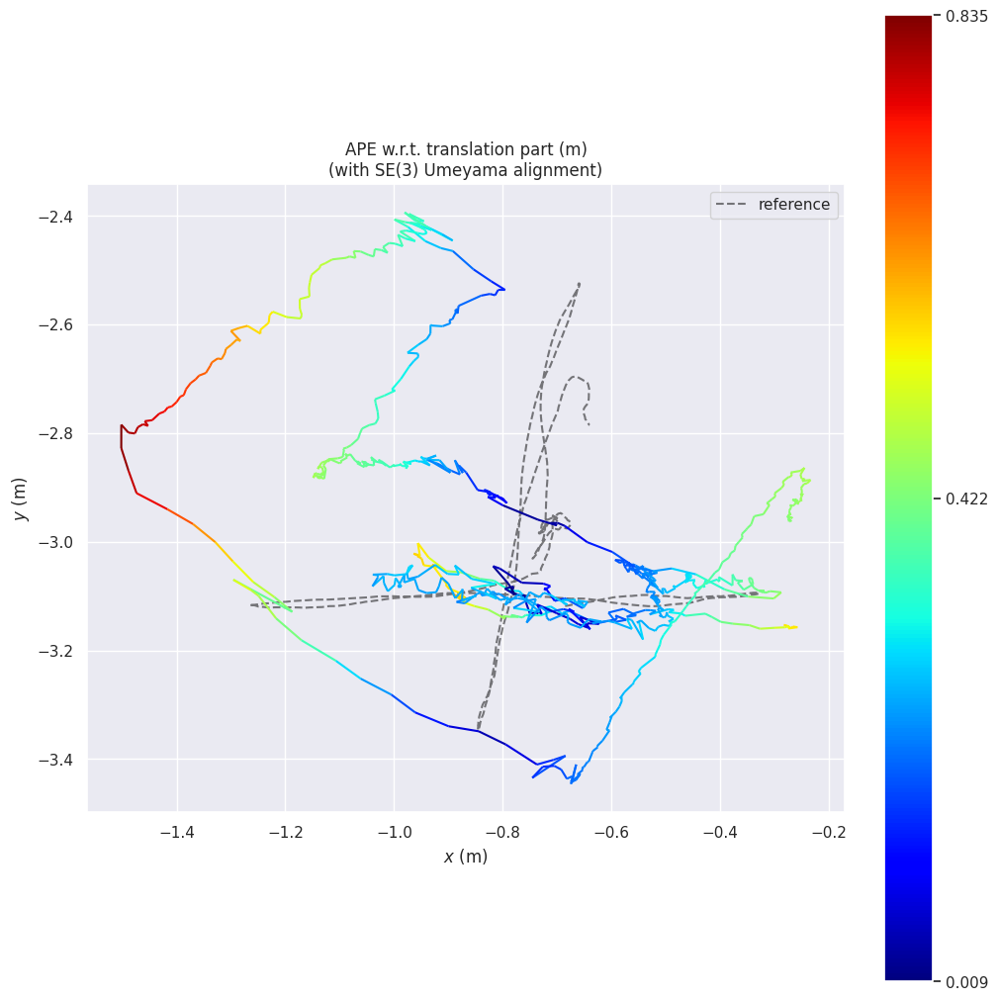
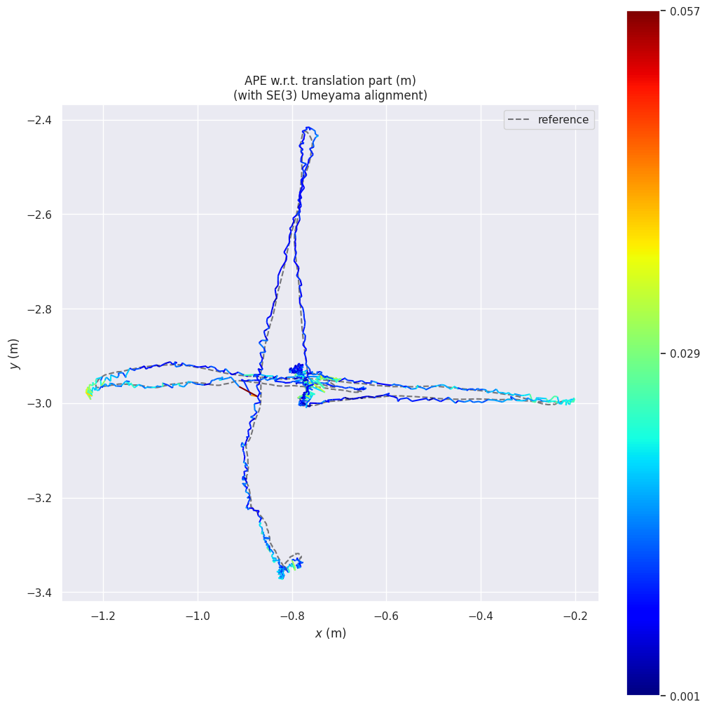
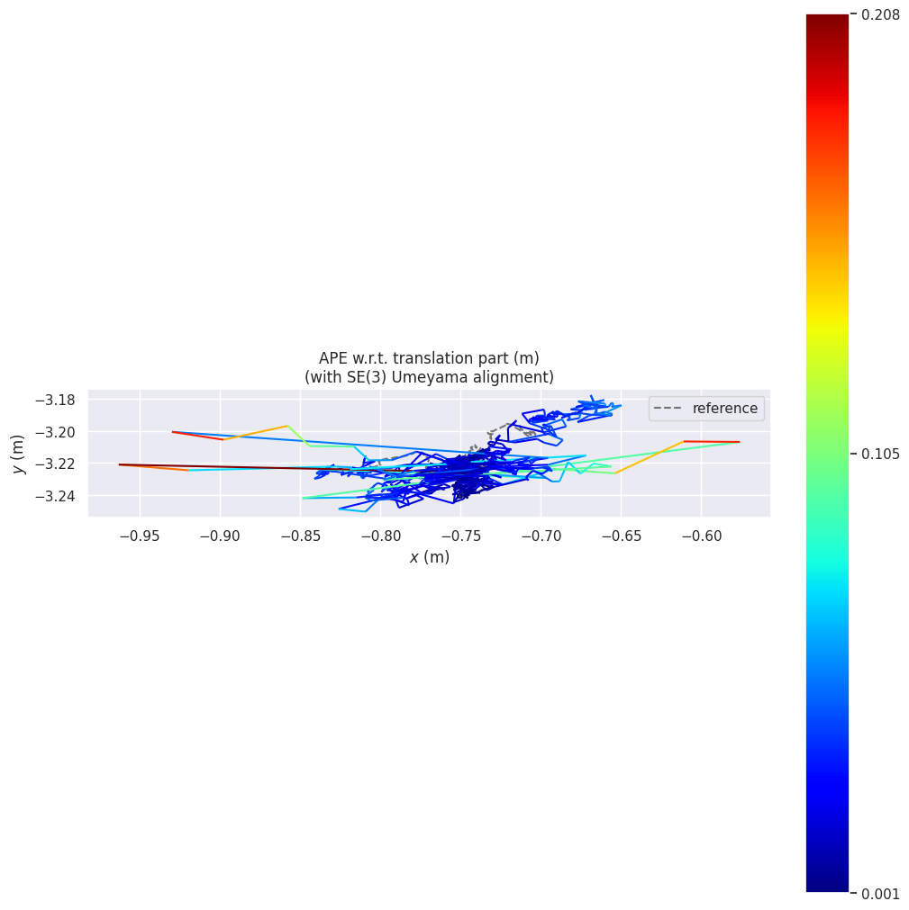
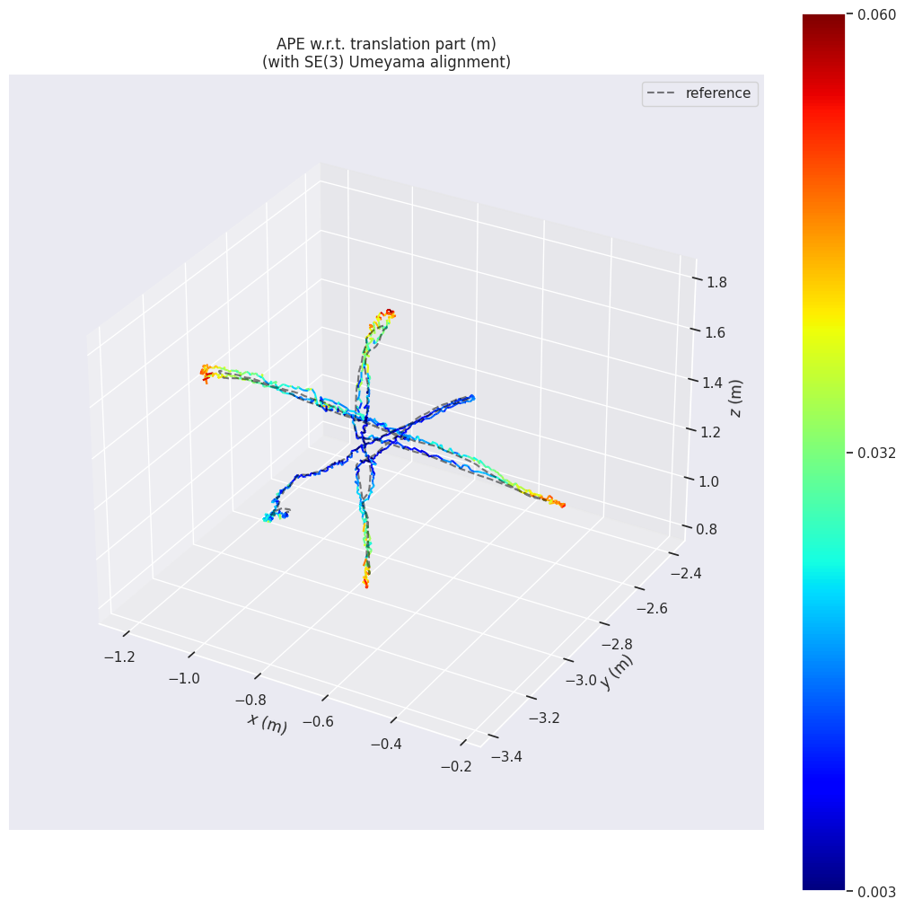
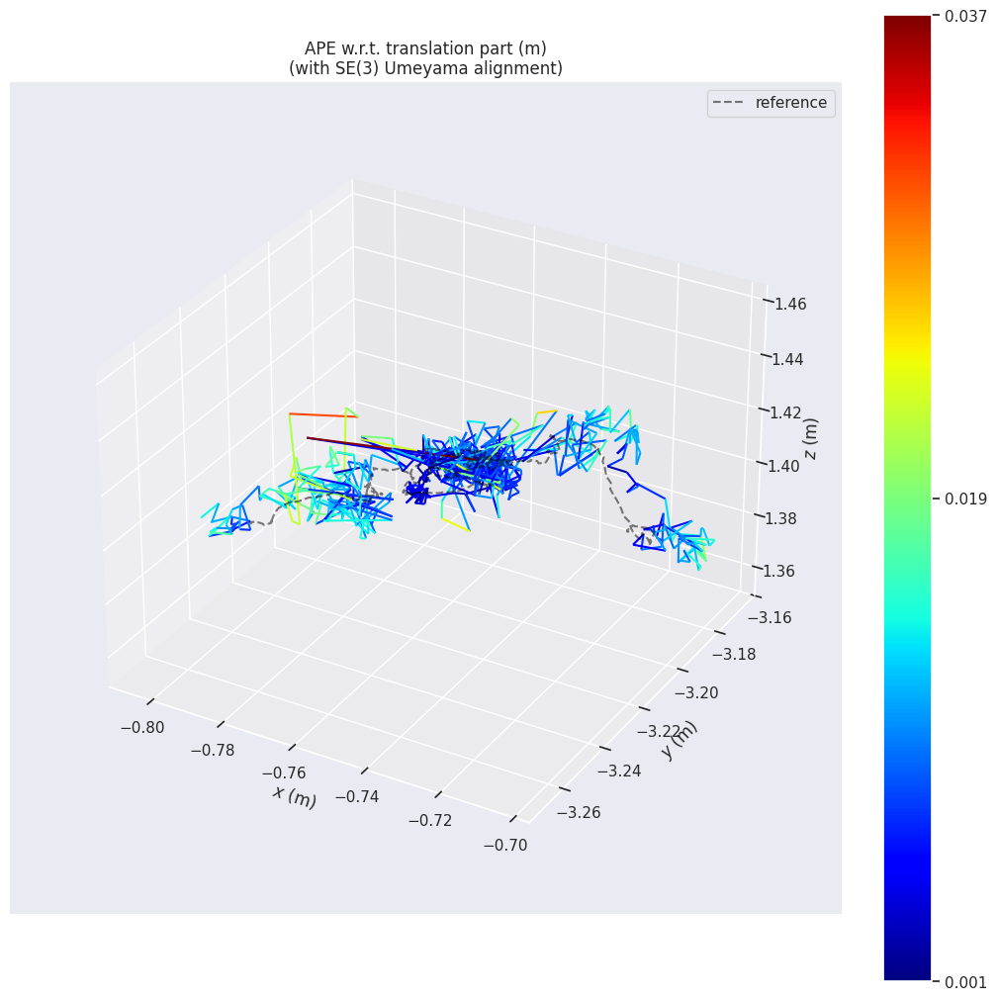
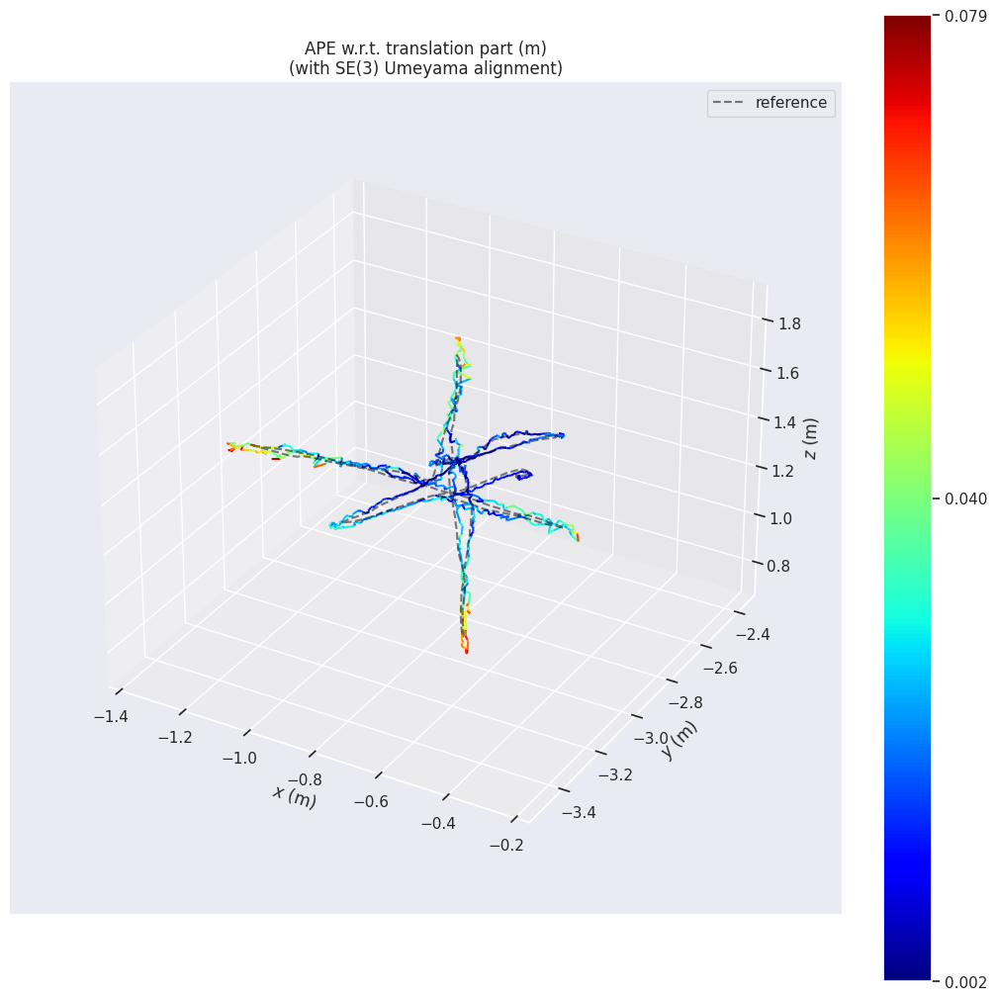

# Ghost-Free SLAM 🚀
### Recovering Static Scene Geometry in Crowded Dynamic Environments

Ghost-Free SLAM measures how much moving people hurt ORB-SLAM3 on dense RGB-D sequences, and how much of that damage can be undone by masking them out before feature extraction. Nothing inside ORB-SLAM3 is modified. Dynamic pixels are removed at the image level and the SLAM backend is treated as a black box.

The project started as a CS585 (Computer Vision) team project at Boston University in Spring 2026 and is now being extended toward a journal submission (IEEE RA-L).

**Status (September 2026):** all three experimental configurations have been run on all three TUM RGB-D `freiburg3` sequences. Trajectories, evo plots, and masking quality reports are committed. Current work is on the follow-up described in [What comes next](#-what-comes-next).

---

## 🧩 Problem statement

**The problem.** Feature-based visual SLAM systems such as ORB-SLAM3 estimate the camera pose by matching features across frames. They assume that almost all of those features belong to static scene structure. In a crowded indoor scene this assumption breaks: people walking through the view create features that move on their own, independent of the camera. ORB-SLAM3 treats these features as static, so they corrupt data association, get inserted into the map, and make the estimated trajectory drift. On the TUM `walking_xyz` sequence, where two people walk through the scene, the baseline camera ATE is 0.3412 m. On `sitting_xyz`, where the people barely move, it is 0.0151 m.

**Research question.**

> Does segmentation-based dynamic removal, combined with minimal geometric reprojection, reduce trajectory drift in crowded indoor RGB-D sequences?

**What we do.** ORB-SLAM3 itself stays unchanged. We only change the images it receives:

1. **Remove moving people** before feature extraction, using YOLO26 instance segmentation to mask person pixels in every RGB frame.
2. **Recover the static background** hidden behind the masked people, using depth-consistent reprojection from earlier frames, and only where that background was actually observed before.
3. **Measure the effect** by running three configurations (baseline, masking only, masking + reprojection) on the same three TUM RGB-D sequences and comparing the Absolute Trajectory Error (ATE) of both camera and keyframe trajectories.

**Scope.** This is a controlled empirical study, not a new SLAM algorithm. There is no learned inpainting, no dynamic object tracking, and no change to bundle adjustment or any other part of the SLAM backend.

---

## 📌 Headline result

On `freiburg3_walking_xyz` (two people walking through the scene while the camera moves), masking dynamic pixels cuts ORB-SLAM3's camera-trajectory Absolute Trajectory Error from **0.3412 m to 0.0266 m**, a **92.2%** reduction. On `walking_static` the drop is 79.7% (0.0517 m to 0.0105 m). On `sitting_xyz`, where people barely move, masking makes things worse (0.0151 m to 0.0289 m).

<table>
  <tr>
    <th>Baseline ORB-SLAM3 (walking_xyz)</th>
    <th>Masked ORB-SLAM3 (walking_xyz)</th>
  </tr>
  <tr>
    <td></td>
    <td></td>
  </tr>
  <tr>
    <td>Camera trajectory vs ground truth (dashed). Colour is APE, up to 0.835 m. The estimate drifts far off the ground-truth path.</td>
    <td>Camera trajectory vs ground truth (dashed). Colour is APE, up to 0.071 m. The estimate stays on the ground-truth path. </td>
  </tr>
</table>

---

## 📊 Full results

Absolute Trajectory Error (ATE RMSE, metres) against TUM ground truth after SE(3) alignment, computed with `evo_ape tum <groundtruth> <trajectory> -va`. Both the camera trajectory (a pose for every frame) and the keyframe trajectory (the frames ORB-SLAM3 keeps for mapping and bundle adjustment) are evaluated. This is Table 1 of our final report, and every number can be reproduced from the files in `trajectories/`.

| Sequence | Baseline camera | Baseline keyframe | Masked camera | Masked keyframe | Reprojection camera | Reprojection keyframe |
|---|---:|---:|---:|---:|---:|---:|
| `sitting_xyz` | **0.0151** | **0.0191** | 0.0289 | 0.0327 | 0.0262 | 0.0322 |
| `walking_static` | 0.0517 | 0.0259 | 0.0105 | 0.0090 | **0.0101** | **0.0077** |
| `walking_xyz` | 0.3412 | 0.3283 | **0.0266** | **0.0280** | 0.0282 | 0.0328 |

What the table shows:

* **Masking is where the gain comes from.** Removing person pixels before ORB feature extraction cuts camera ATE by 92.2% on `walking_xyz` and 79.7% on `walking_static`.
* **Masking hurts in a mostly static scene.** In `sitting_xyz` the people barely move, so masking them removes useful background features and camera ATE rises from 0.0151 m to 0.0289 m.
* **Reprojection gives limited extra benefit.** The best case is `walking_static`, where keyframe ATE improves from 0.0090 m to 0.0077 m (about 14%). On `walking_xyz` it is slightly worse than masking alone, because only a small fraction of the masked pixels get recovered. On `sitting_xyz` the change is negligible.
* **Keyframe vs camera.** Keyframe trajectories usually have lower or similar error, since bundle adjustment smooths out some of the leftover noise after masking.
* **We do not match DynaSLAM yet.** DynaSLAM (Bescos et al., 2018) reports 0.015 m on `walking_xyz`, using Mask R-CNN plus multi-view geometry and background inpainting. Our 0.0266 m sits between the raw ORB-SLAM3 baseline and that number. Closing this gap is the point of the follow-up work.

All three configurations track every sequence end to end (1230 / 723 / 833 camera poses, the same count in every configuration), so the differences come from drift, not from lost tracking.

### Result plots

Camera trajectories against ground truth (dashed), taken directly from `results/`. Colour is APE per pose. Map (`*_map.png`) and APE-over-time (`*_raw.png`) plots for camera and keyframe trajectories are in `results/<mode>/camera_trajectories/<sequence>/` and `results/<mode>/keyframe_trajectories/<sequence>/`.

<table>
  <tr>
    <th></th>
    <th>sitting_xyz</th>
    <th>walking_static</th>
    <th>walking_xyz</th>
  </tr>
  <tr>
    <td><b>Baseline</b></td>
    <td></td>
    <td></td>
    <td></td>
  </tr>
  <tr>
    <td><b>Masked</b></td>
    <td></td>
    <td></td>
    <td></td>
  </tr>
  <tr>
    <td><b>Reprojection</b></td>
    <td></td>
    <td></td>
    <td></td>
  </tr>
</table>

Notes on the plots:

* **Baseline plots** are the same images as report Figure 9. They were made from an earlier baseline run (RMSE 0.0157 / 0.0340 / 0.3588 m in their `result.zip`, also in `results/baseline/camera_trajectories/summary.txt`). The table above uses the baseline trajectory files committed in `trajectories/baseline/`, which give 0.0151 / 0.0517 / 0.3412 m, the same as the report's Table 1.
* **Masked plots** are the same images as report Figure 10. The masked camera plot for `walking_xyz` matches the masked trajectory. The masked plots for `sitting_xyz` and `walking_static` (camera and keyframe) and the masked keyframe plot for `walking_xyz` are currently the same image files as the reprojection plots, so their colour scales follow the reprojection trajectories. They will be re-exported from `trajectories/masked/`.
* **Reprojection plots** match the reprojection trajectories and report Figure 11.

---

## 🔬 System pipeline

```
TUM RGB-D sequence (rgb/, depth/, rgb.txt, depth.txt)
        │
        ▼
YOLO26m-seg instance segmentation, person class only        segmentation/run_instance_segmentation.py
  conf 0.22, IoU 0.4, 4x4 dilation, 21x21 Gaussian blur
        │
        ▼
Clean binary mask + masked RGB frames (depth untouched)     masking/apply_masks.py
        │
        ├──────────────────────────────────────────────┐
        ▼                                              ▼
ORB-SLAM3 RGB-D, headless, "masked" mode      reprojection/reproject.py
        │                                     fills masked pixels from earlier frames
        │                                     using masked-run poses + depth
        │                                              │
        │                                              ▼
        │                              ORB-SLAM3 RGB-D, "reprojection" mode
        ▼                                              ▼
CameraTrajectory.txt / KeyFrameTrajectory.txt  ──►  evo_ape (ATE RMSE) + plots
```

`slam/run_slam.sh <sequence> <mode>` is the single entry point for the SLAM stage. `mode` is `baseline`, `masked`, or `reprojection` and only changes which image folder ORB-SLAM3 reads.

### Segmentation and masking details

* Model: Ultralytics `yolo26m-seg.pt` (medium). We started with `yolo26n-seg.pt` (nano) and switched to medium in mid April after reworking the mask generation. Both weight files are committed at the repo root.
* Only COCO class 0 (person) is segmented. The TUM `freiburg3` dynamic sequences contain no other moving objects.
* Confidence threshold is deliberately low (0.22) and every mask is dilated by 4 px and blurred with a 21x21 kernel, then thresholded at 0.3. Over-masking a person's outline is much cheaper for SLAM than leaving a strip of moving pixels behind.
* `masking/apply_masks.py` derives a clean binary mask (pixels black in the YOLO output but not black in the original) and zeroes those pixels in the original RGB. Depth is never modified. Frames with no detection are copied through unchanged.

<p align="center">
  
  <br>
  <em>walking_xyz, original vs masked frame. More example strips in <code>masking/masked_frames/examples/</code>.</em>
</p>

### Masking quality (from `evaluation/validate_masking.py`)

The `evaluation/` folder is only for this mask quality check. All SLAM trajectory plots and ATE numbers are in `results/`.

The validation script flags three failure types per frame: missed detection (no mask saved), partial mask (a connected region far too small for a person) and over-mask (region implausibly large). Numbers below are from `evaluation/validation_report/summary.txt`.

| Sequence | Frames | Frames with mask | Missed | Over-mask | Partial | Avg masked area |
|---|---:|---:|---:|---:|---:|---:|
| sitting_xyz | 1261 | 1261 | 0 (0.0%) | 56 (4.4%) | 31 (2.5%) | 21.6% |
| walking_static | 743 | 698 | 45 (6.1%) | 84 (12.0%) | 38 (5.4%) | 19.3% |
| walking_xyz | 859 | 776 | 83 (9.7%) | 132 (17.0%) | 19 (2.4%) | 19.8% |
| **Overall** | **2863** | **2735 (95.5%)** | **128 (4.5%)** | **272** | **88** | |

Across all sequences, 95.5% of frames are masked (2735 of 2863), with 128 missed detections. Over-masking happens in 9.9% of masked frames and partial masking in 3.2%. Over-masking does less harm to SLAM than under-masking: it removes some extra static features, but it does not let moving pixels into the map. Missed and partial masks grow with scene dynamics, since motion blur and occlusion in `walking_xyz` make people harder to segment, and those leftover dynamic regions are one reason we still trail DynaSLAM. Comparison grids and flagged failure frames for every sequence are in `evaluation/validation_report/<sequence>/`.

### 🧠 Geometric recovery (reprojection)

Masking removes moving people, but it also throws away the static background behind them. Reprojection tries to give ORB-SLAM3 that background back using RGB-D geometry:

1. Take the camera poses from the **masked** ORB-SLAM3 run (`trajectories/masked/camera_trajectories/`).
2. Back-project each valid depth pixel of an earlier frame into 3D using the camera intrinsics, transform it into the current frame with the estimated poses, and project it into the masked region.
3. Use several earlier frames, at offsets of 1, 2, 3, 5, 8 and 10 frames, to see the background from more viewpoints. When several points land on the same pixel, a depth z-buffer keeps the closest one.
4. Only depth-consistent points are kept. Regions never seen before are left masked, so no geometry is invented.
5. Write the recovered frames to `reprojection/recovered_frames/<sequence>/` and run ORB-SLAM3 in `reprojection` mode on them.

Recovery grows with camera motion. In `sitting_xyz` only about 5% of masked pixels are recovered, while the walking sequences recover more thanks to larger viewpoint changes. Overall coverage stays small, which is why reprojection adds little on top of masking.

**Note on the reprojection code version.** The multi-frame method described above (offsets 1, 2, 3, 5, 8 and 10 with a depth z-buffer) is the one described in the final report, which the report uses for its reprojection results and its recovery-vs-lookback analysis. It was implemented by Tianqin Fu in commit `f9d6f006` (26 April 2026). A later cleanup of `reprojection/reproject.py` (commits `25d31061` and `fabf86ac`, 27 to 28 April) first reduced the offsets to 1, 2, 3, 5, 8 and then simplified the script to use only the single previous frame, and that simplified version is what is on `main` now. To run the multi-frame version as described in the report:

```bash
git show f9d6f006:reprojection/reproject.py > reprojection/reproject_multiframe.py
```

---

## 📁 Repository structure

```
Ghost-Free-SLAM/
│
├── segmentation/
│   ├── run_instance_segmentation.py   # YOLO26m-seg person masks (current pipeline)
│   ├── run_inst_seg.sh                # SCC qsub wrapper (1 GPU)
│   ├── evaluate_segmentation.py       # early per-frame detection count check
│   ├── instructions.txt               # venv setup
│   └── binary_mask_gen/               # first version: yolo26n-seg, plain binary masks
│
├── masking/
│   ├── apply_masks.py                 # clean masks + masked RGB frames + example strips
│   ├── masks/<sequence>/              # YOLO output per frame (timestamp.png)
│   └── masked_frames/<sequence>/      # rgb/ (masked) and depth/ (original), fed to ORB-SLAM3
│
├── reprojection/
│   └── reproject.py                   # depth-based reprojection into masked regions
│
├── slam/
│   ├── run_slam.sh                    # run ORB-SLAM3 RGB-D: <sequence> <baseline|masked|reprojection>
│   ├── run_full_pipeline.sh           # older loop over all sequences in masked mode
│   └── TUM1_headless.yaml             # ORB-SLAM3 TUM1 config with Viewer.on: 0 for SCC
│
├── evaluation/                        # mask quality only, no SLAM plots
│   ├── validate_masking.py            # masking quality report (missed / partial / over-mask)
│   └── validation_report/             # summary.txt + comparison grids + failure frames
│
├── trajectories/<mode>/               # raw ORB-SLAM3 CameraTrajectory / KeyFrameTrajectory (TUM format)
├── results/
│   ├── groundtruth/<sequence>/        # TUM groundtruth.txt
│   └── <mode>/camera_trajectories/    # evo map/raw plots, result.zip, summary.txt
│
├── requirements.txt/yolo26_requirements.txt
├── yolo26m-seg.pt, yolo26n-seg.pt     # segmentation weights
└── README.md
```

Modes are `baseline`, `masked`, `reprojection`. Sequences are `sitting_xyz`, `walking_static`, `walking_xyz`.

---

## ⚙ Running the pipeline on the BU SCC

Everything was run on the Boston University Shared Computing Cluster. Paths below are the ones hard-coded in the scripts; adjust `BASE_PATH` in `slam/run_slam.sh` and the `dataset_root` / `base` variables in the Python scripts if you run elsewhere.

**1. Environment (segmentation, masking, evaluation)**

```bash
module load python3/3.10.12
python3 -m venv env && source env/bin/activate
pip install --upgrade pip
pip install -r requirements.txt/yolo26_requirements.txt   # ultralytics, opencv-python, numpy<2, matplotlib
pip install evo                                          # trajectory evaluation
```

Torch is provided by the SCC modules; uncomment the torch lines in the requirements file if you are on a laptop.

**2. ORB-SLAM3**

Build ORB-SLAM3 (RGB-D example) once at `$BASE_PATH/ORB_SLAM3`. `run_slam.sh` loads `gcc/12.2.0 cmake eigen opencv cuda/11.3 vtk` and runs `Examples/RGB-D/rgbd_tum` headlessly. `slam/TUM1_headless.yaml` is the stock TUM1 calibration with the Pangolin viewer turned off.

**3. Segment people (GPU job)**

```bash
qsub segmentation/run_inst_seg.sh      # writes masking/masks/<sequence>/<timestamp>.png
```

**4. Build masked frames**

```bash
python masking/apply_masks.py          # writes masking/masked_frames/<sequence>/{rgb,depth}
python evaluation/validate_masking.py  # optional: masking quality report
```

**5. Run SLAM**

```bash
bash slam/run_slam.sh walking_xyz baseline
bash slam/run_slam.sh walking_xyz masked
```

Trajectories land in `trajectories/<mode>/camera_trajectories/<mode>_camera_<sequence>.txt` and the matching `keyframe_trajectories/` folder. `associations.txt` is generated automatically if missing.

**6. Reprojection (needs the masked-run trajectory from step 5)**

```bash
python reprojection/reproject.py --sequence walking_xyz   # or --all
bash slam/run_slam.sh walking_xyz reprojection
```

**7. Evaluate**

```bash
evo_ape tum results/groundtruth/walking_xyz/groundtruth.txt \
        trajectories/masked/camera_trajectories/masked_camera_walking_xyz.txt \
        -a --plot_mode xyz --save_plot results/masked/camera_trajectories/walking_xyz/map.png
```

---

## 📊 Dataset

TUM RGB-D Dataset, `freiburg3` dynamic-object sequences: https://vision.in.tum.de/data/datasets/rgbd-dataset

| Sequence | Frames | What moves |
|---|---:|---|
| `rgbd_dataset_freiburg3_sitting_xyz` | 1261 | Two people sitting at a desk, small gestures. Camera moves along x, y, z. |
| `rgbd_dataset_freiburg3_walking_static` | 743 | Two people walking. Camera is nearly still. |
| `rgbd_dataset_freiburg3_walking_xyz` | 859 | Two people walking. Camera moves along x, y, z. Hardest of the three. |

Raw sequences are not in this repo. They live at `/projectnb/cs585/projects/dynamic_slam/dataset/tum_rgbd/` on the SCC. The masked RGB frames, masks, and ground-truth files are committed so the SLAM and evaluation stages can be re-run without re-segmenting.

### SCC project layout

```
/projectnb/cs585/projects/dynamic_slam/
│
├── dataset/tum_rgbd/          # the three freiburg3 sequences
├── ORB_SLAM3/                 # built ORB-SLAM3 (Examples/RGB-D/rgbd_tum, Vocabulary/ORBvoc.txt)
├── trajectories/<mode>/       # SLAM outputs (mirrored into this repo)
├── logs/
└── Ghost-free-slam/           # this repository
```

---

## 🎯 What comes next

The CS585 deliverable is done. The RA-L extension, advised by Prof. Andrew Wood, is about the gap to DynaSLAM without paying DynaSLAM's cost:

* Replace the closed-set person masks with **lightweight open-set dynamic object removal**, so anything that moves (not just COCO "person") is filtered, at a runtime that still fits a real-time RGB-D pipeline.
* **Adaptive masking**: mask only regions that are actually moving, so static scenes like `sitting_xyz` stop losing useful features.
* **Temporally consistent segmentation**: add tracking or smoothing across frames to cut flickering masks and missed detections in highly dynamic sequences.
* **Better recovery of occluded background**: multi-frame reprojection recovers only a small share of masked pixels. Dense mapping or learned inpainting could fill more.
* **Tighter perception and SLAM integration**: bring dynamic-object awareness into the SLAM optimization itself instead of keeping it as a preprocessing step.

---

## 👥 Team

| Member | Responsibility |
|--------|----------------|
| **Mansi Singh** (lead researcher and author) | Depth-consistent geometric reprojection, coordinate transformations, ORB-SLAM3 integration, ATE analysis |
| **Tianqin Fu** | Depth-consistent geometric reprojection, coordinate transformations, ORB-SLAM3 integration, ATE analysis |
| **Bhoomika Monthy Rajashekar** | YOLO26 instance segmentation, segmentation evaluation (detection accuracy, over-masking, partial masking) |
| **Devinn Chi** | YOLO26 instance segmentation, segmentation evaluation (detection accuracy, over-masking, partial masking) |
| **Brendan Coyne** | Dataset preparation, automated experiment runs, ATE statistics, and visual comparisons across configurations |

Advisor: Andrew Wood, Boston University.

---

## 📚 References

* Campos et al., 2021. ORB-SLAM3: An Accurate Open-Source Library for Visual, Visual-Inertial, and Multi-Map SLAM. IEEE T-RO.
* Mur-Artal and Tardós, 2017. ORB-SLAM2: An Open-Source SLAM System for Monocular, Stereo, and RGB-D Cameras. IEEE T-RO.
* Bescos et al., 2018. DynaSLAM: Tracking, Mapping and Inpainting in Dynamic Scenes. IEEE RA-L.
* Yu et al., 2018. DS-SLAM: A Semantic Visual SLAM Towards Dynamic Environments. IROS.
* Sun et al., 2017. Improving RGB-D SLAM in Dynamic Environments: A Motion Removal Approach. Robotics and Autonomous Systems.
* Dai et al., 2020. RGB-D SLAM in Dynamic Environments Using Point Correlations. IEEE TPAMI.
* Engel et al., 2015. Large-Scale Direct SLAM with Stereo Cameras. IROS.
* Sturm et al., 2012. A Benchmark for the Evaluation of RGB-D SLAM Systems. IROS. (TUM RGB-D dataset)
* Grupp, 2017. evo: Python package for the evaluation of odometry and SLAM. https://github.com/MichaelGrupp/evo

---

## 👩‍💻 Maintainer

**Mansi Singh** <br>
MS Robotics and Autonomous Systems, Boston University <br>
🔗 GitHub: https://github.com/Mansi-1120
